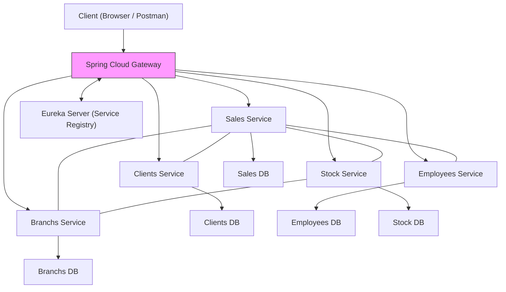
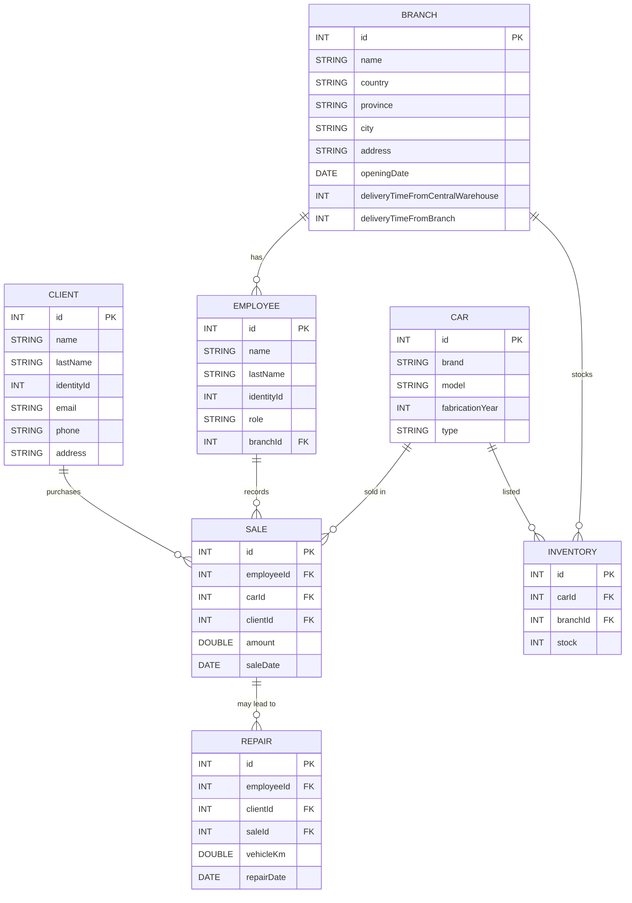

# TP Microservicios

Plataforma demostrativa basada en Spring Cloud que expone un conjunto de **micro-servicios** para la gestión integral de una concesionaria de autos.

---
## 1 · Arquitectura general

### Vista de alto nivel

### Componentes
* **Gateway** – punto de entrada público, balancea y enruta peticiones.
* **Eureka Server** – discovery dinámico; cada micro-servicio se registra aquí.
* **Micro-servicios de dominio**
  * `branchs` – gestiona sucursales.
  * `clients` – gestiona clientes.
  * `employees` – gestiona empleados.
  * `stock` – catálogo de autos e inventario por sucursal.
  * `sales` – ventas y reparaciones post-venta.
* **commons** – librería compartida (CORS, manejo global de excepciones, modelos comunes).

---
## 2 · API pública por servicio
Cada servicio implementa CRUD, búsqueda dinámica (`/search`) y verificación de existencia (`/exists/{id}`).

| Servicio | Base-path | Endpoints clave |
|----------|-----------|-----------------|
| Branchs | `/branchs` | `/`, `/{id}`, `/search`, `/exists/{id}` |
| Clients | `/clients` | `/`, `/{id}`, `/search`, `/exists/{id}` |
| Employees | `/employees` | `/`, `/{id}`, `/search`, `/exists/{id}` |
| Stock – Cars | `/stock/catalog/cars` | `/`, `/{id}`, `/search` |
| Stock – Inventory | `/stock/inventory` | `/`, `/{id}`, `/search` |
| Sales – Billing | `/sales/billing` | `/`, `/{id}`, `/search` |
| Sales – Repairs | `/sales/repairs` | `/`, `/{id}`, `/search` |

> Para probarlos rápidamente, importa la colección Postman mencionada en la sección 4.

---
## 3 · Modelo de datos y persistencia
Cada micro-servicio posee **su propia base de datos / esquema**. Las relaciones se resuelven a nivel de aplicación mediante IDs; no hay acoplamiento de base de datos compartida.

---
## 4 · Colección Postman
Se añadió en la raíz del repo el archivo `tp-microservicios.postman_collection.json` con todos los endpoints agrupados.

1. **Importar** el archivo en Postman/Insomnia.
2. Configurar la variable de entorno `baseUrl` (por defecto `http://localhost:8080`, que es el Gateway).
3. Navegar por las carpetas de cada micro-servicio y ejecutar las peticiones.

---
¡Listo! Con esto tienes una visión completa de la solución y cómo probarla rápidamente. 🚀
