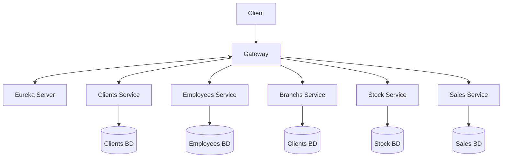

# TP Microservicios

Plataforma demostrativa basada en Spring que expone un conjunto de **micro-servicios** para la gestión integral de una concesionaria de autos.

## Instrucciones

Inicializar los proyectos en el siguiente orden:

  * 1- **eureka-server**
  * 2- **gateway**
  * 3-  **Micro-servicios de dominio** `(branchs, clients, employees, stock, sales)`

  * Al levantar las APIs se crean en memoria las bases y se populan automaticamente a partir de los .sql que se encuentran en la carpeta `resources` de cada API.  

  Luego se puede testear la aplicacion de dos formas:

   * Ingresar a http://localhost:8080/swagger-ui.html
   * Importar la coleccion de Postman `(tp-microservicios.postman_collection.json)` que se encuentra en el directorio raiz.

## 1 · Arquitectura general

### Componentes
* **Gateway** – punto de entrada público, balancea y enruta peticiones.
* **Eureka Server** – discovery dinámico; cada micro-servicio se registra aquí.
* **Micro-servicios de dominio**
  * `branchs` – gestiona sucursales.
  * `clients` – gestiona clientes.
  * `employees` – gestiona empleados.
  * `stock` – catálogo de autos e inventario por sucursal.
  * `sales` – ventas y reparaciones post-venta.
* **commons** – librería compartida (CORS, manejo global de excepciones, modelos comunes).

## 2 · API pública por servicio

A continuación se detallan los endpoints disponibles para cada micro-servicio. Todos son accesibles a través del API Gateway (`http://localhost:8080`).

### Branchs Service (`/branchs`)
- **`GET /`**: Obtener todas las sucursales.
- **`GET /{id}`**: Obtener una sucursal por su ID.
- **`POST /`**: Crear una nueva sucursal.
- **`PUT /{id}`**: Actualizar una sucursal existente.
- **`DELETE /{id}`**: Eliminar una sucursal.
- **`GET /search`**: Buscar sucursales por nombre, país, provincia, ciudad o dirección.
- **`GET /exists/{id}`**: Verificar si una sucursal existe.

### Clients Service (`/clients`)
- **`GET /`**: Obtener todos los clientes.
- **`GET /{id}`**: Obtener un cliente por su ID.
- **`POST /`**: Crear un nuevo cliente.
- **`PUT /{id}`**: Actualizar un cliente existente.
- **`DELETE /{id}`**: Eliminar un cliente.
- **`GET /search`**: Buscar clientes por nombre, apellido, DNI, email, teléfono o dirección.
- **`GET /exists/{id}`**: Verificar si un cliente existe.

### Employees Service (`/employees`)
- **`GET /`**: Obtener todos los empleados.
- **`GET /{id}`**: Obtener un empleado por su ID.
- **`POST /`**: Crear un nuevo empleado.
- **`PUT /{id}`**: Actualizar un empleado existente.
- **`DELETE /{id}`**: Eliminar un empleado.
- **`GET /search`**: Buscar empleados por nombre, apellido, DNI, rol o ID de sucursal.
- **`GET /exists/{id}`**: Verificar si un empleado existe.

### Stock Service (`/stock`)
#### Catálogo de Autos (`/catalog/cars`)
- **`GET /`**: Obtener todos los autos del catálogo.
- **`GET /{id}`**: Obtener un auto por su ID.
- **`POST /`**: Añadir un nuevo auto al catálogo.
- **`PUT /{id}`**: Actualizar un auto del catálogo.
- **`DELETE /{id}`**: Eliminar un auto del catálogo.
- **`GET /search`**: Buscar autos por marca, modelo, año o tipo.
#### Inventario (`/inventory`)
- **`GET /`**: Obtener todo el inventario de todas las sucursales.
- **`GET /{id}`**: Obtener un registro de inventario por su ID.
- **`POST /`**: Crear un registro de inventario.
- **`PUT /{id}`**: Actualizar un registro de inventario.
- **`DELETE /{id}`**: Eliminar un registro de inventario.
- **`GET /search`**: Buscar en el inventario por ID de auto, ID de sucursal o stock disponible.

### Sales Service (`/sales`)
#### Ventas (`/billing`)
- **`GET /`**: Obtener un resumen de todas las ventas.
- **`GET /{id}`**: Obtener el detalle de una venta por su ID.
- **`POST /`**: Registrar una nueva venta.
- **`DELETE /{id}`**: Eliminar una venta.
- **`GET /search`**: Buscar ventas por ID de empleado, ID de auto, ID de cliente o fecha.
#### Reparaciones (`/repairs`)
- **`GET /`**: Obtener un resumen de todas las reparaciones.
- **`GET /{id}`**: Obtener el detalle de una reparación por su ID.
- **`POST /`**: Registrar un nuevo servicio de reparación.
- **`DELETE /{id}`**: Eliminar un servicio de reparación.
- **`GET /search`**: Buscar reparaciones por ID de empleado, ID de auto o fecha.

## 3 · Modelo de datos y persistencia

Cada micro-servicio posee **su propia base de datos / esquema**. Las relaciones se resuelven a nivel de aplicación mediante IDs.

